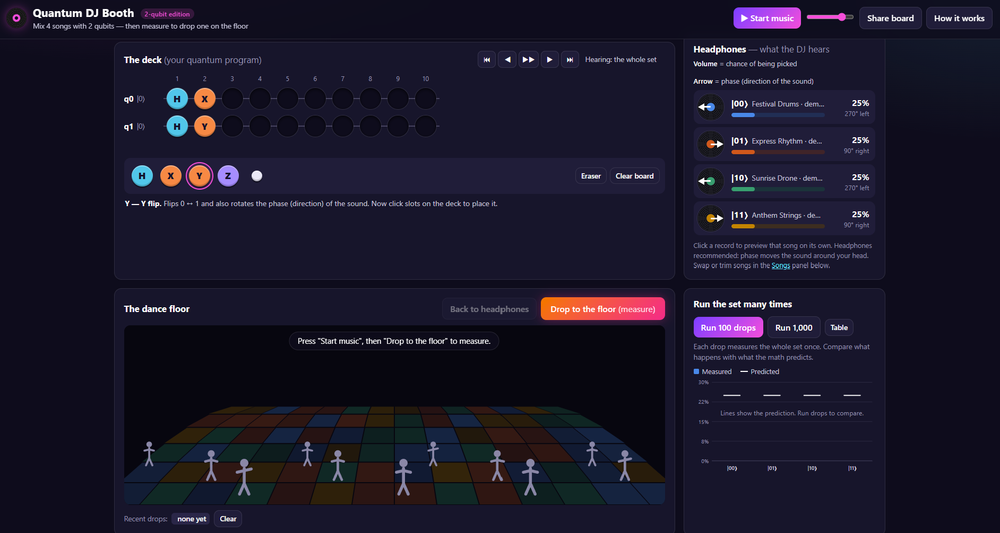

# Qiskit DJ Booth

A browser-based classroom simulator: build a 2-qubit circuit from gate pieces (H, X, Y, Z, ● + X = CNOT),
hear the superposition as a mix of 4 tracks, then "drop" to measure and send one track to the dance floor.

Flask serves the UI and two JSON endpoints; all quantum maths runs in **Qiskit SDK v2** on a local
simulator (never real hardware).

## Run

    uv sync
    uv run flask --app app run     # http://127.0.0.1:5000

## API

- `POST /api/compute` `{circuit}` → `states` (re/im after each of the 10 steps), `probabilities`, `exact`, `columns`
- `POST /api/drop` `{circuit, steps?, shots?}` → `index` (one shot), `counts`, `probabilities`

A circuit is a list of columns, each `[cell, cell]` with cell `null` or `{"type": "H"|"X"|"Y"|"Z"|"CTRL"}`.

## Layout

- `app.py` Flask app · `qdj/simulator.py` Qiskit simulation · `templates/index.html` + `static/` UI
- `tests/` pytest suite: `uv run pytest`

## Songs

Tracks play built-in synthesized demo beats (Festival Drums, Express Rhythm, Sunrise Drone, Anthem Strings).
Use the Songs panel to load your own audio files per track; they stay in your browser.
